# Distributed Cache Practice

A comprehensive Spring Boot application demonstrating various cache problems and their solutions using Redis and Java 21.


## Architecture Overview

This application simulates a book catalog service that demonstrates the four main cache problems described in Alex Xu's diagram:

1. **Thunder Herd Problem** - Multiple keys expiring simultaneously
2. **Cache Penetration** - Requests for non-existent data
3. **Cache Breakdown** - Hot key expiration causing database overload
4. **Cache Crash** - Cache system becoming unavailable

## Code Organization: Production vs Demo Components

This project contains both **production-ready components** and **demonstration/testing components**. Understanding this distinction is crucial for real-world deployment:

```mermaid
graph TB
    subgraph "🏭 PRODUCTION COMPONENTS"
        subgraph "Core Services"
            A1[BookService]
            A2[BookCacheService]
            A3[RedisBloomFilterService]
            A4[BloomFilterMaintenanceService]
        end
        
        subgraph "Configuration"
            B1[RedisConfig]
            B2[CacheProperties]
            B3[application.yml]
        end
        
        subgraph "Data Layer"
            C1[Book Entity]
            C2[BookRepository]
        end
        
        subgraph "Infrastructure"
            D1[DistributedCacheApplication]
            D2[docker-compose.yml]
        end
    end
    
    subgraph "🧪 TESTING/DEMO COMPONENTS"
        subgraph "Simulation Services"
            E1[CacheSimulationService]
            E2[DataInitializationService]
        end
        
        subgraph "Demo Controllers"
            F1[CacheProblemsController]
            F2[BloomFilterController*]
        end
        
        subgraph "Test Scripts"
            G1[test-cache.ps1]
            G2[start.sh/start.bat]
        end
    end
    
    subgraph "📊 MONITORING (Production + Testing)"
        H1[MonitoringController]
        H2[BookController]
    end
    
    style A1 fill:#c8e6c9,color:#000000
    style A2 fill:#c8e6c9,color:#000000
    style A3 fill:#c8e6c9,color:#000000
    style A4 fill:#c8e6c9,color:#000000
    style B1 fill:#c8e6c9,color:#000000
    style B2 fill:#c8e6c9,color:#000000
    style B3 fill:#c8e6c9,color:#000000
    style C1 fill:#c8e6c9,color:#000000
    style C2 fill:#c8e6c9,color:#000000
    style D1 fill:#c8e6c9,color:#000000
    style D2 fill:#c8e6c9,color:#000000
    
    style E1 fill:#ffecb3,color:#000000
    style E2 fill:#ffecb3,color:#000000
    style F1 fill:#ffecb3,color:#000000
    style F2 fill:#ffecb3,color:#000000
    style G1 fill:#ffecb3,color:#000000
    style G2 fill:#ffecb3,color:#000000
    
    style H1 fill:#e1f5fe,color:#000000
    style H2 fill:#e1f5fe,color:#000000
```



### 🏭 **Production-Ready Components** (Keep for Real Applications)

- **Core Services**: `BookService`, `BookCacheService`, `RedisBloomFilterService`, `BloomFilterMaintenanceService`
- **Configuration**: `RedisConfig`, `CacheProperties`, `application.yml`
- **Data Layer**: `Book` entity, `BookRepository`
- **Infrastructure**: Main application class, Docker configuration

### 🧪 **Demo/Testing Components** (Remove for Production)

- **Simulation Services**: `CacheSimulationService`, `DataInitializationService`
- **Demo Controllers**: `CacheProblemsController`
- **Test Scripts**: PowerShell and shell scripts
- **Special Note**: `BloomFilterController` contains both management endpoints (production) and testing endpoints (demo)

### 📊 **Monitoring Components** (Production + Testing Features)

- **`MonitoringController`**: Health checks and metrics (production) + detailed cache statistics (helpful for both)
- **`BookController`**: Standard REST API (production ready)

## Technologies Used

- **Java 21**
- **Spring Boot 3.2**
- **Spring Framework 6.1**
- **Redis 7.2** (for caching)
- **H2 Database** (in-memory database)
- **Gradle** (build tool)
- **Docker & Docker Compose** (containerization)
- **Resilience4j** (circuit breaker pattern)
- **Google Guava** (bloom filter implementation)
- **Micrometer** (metrics and monitoring)

## Cache Problems & Solutions Implemented

### 1. Thunder Herd Problem
**Problem**: Large number of keys expire at the same time, causing concurrent database requests.

**Solutions Implemented**:
- **Random TTL Jitter**: Add 0-20% random jitter to cache expiration times
- **Core Business Data Priority**: Allow only core business data to hit the database during cache rebuilding

**API Endpoint**: `POST /api/cache-problems/thunder-herd/simulate`

### 2. Cache Penetration
**Problem**: Requests for non-existent keys bypass cache and hit database repeatedly.

**Solutions Implemented**:
- **Bloom Filter**: Check key existence before database queries
- **Null Value Caching**: Cache null results for non-existent keys with shorter TTL

**API Endpoint**: `POST /api/cache-problems/penetration/simulate`

### 3. Cache Breakdown
**Problem**: Hot key expires causing multiple concurrent requests to hit database.

**Solutions Implemented**:
- **No Expiry for Hot Keys**: Popular and bestseller books cached without expiration
- **Hot Key Detection**: Automatic identification of frequently accessed keys

**API Endpoint**: `POST /api/cache-problems/breakdown/simulate`

### 4. Cache Crash
**Problem**: Cache system becomes unavailable, all requests go to database.

**Solutions Implemented**:
- **Circuit Breaker Pattern**: Prevent cascade failures when Redis is down
- **Database Fallback**: Graceful degradation to direct database access
- **Redis Cluster Setup**: High availability through clustering (configured in docker-compose)

**API Endpoint**: `POST /api/cache-problems/crash/simulate`

## Project Structure

```
src/main/java/me/valizadeh/practices/cache/
├── DistributedCacheApplication.java          # Main application
├── config/
│   └── RedisConfig.java                      # Redis configuration
├── controller/
│   ├── BookController.java                   # Book CRUD operations
│   ├── CacheProblemsController.java          # Cache problem simulations
│   └── MonitoringController.java             # Health and metrics
├── entity/
│   └── Book.java                             # Book entity
├── repository/
│   └── BookRepository.java                   # Data access layer
└── service/
    ├── BloomFilterService.java               # Bloom filter implementation
    ├── BookCacheService.java                 # Main cache service
    ├── BookService.java                      # Business logic
    ├── CacheSimulationService.java           # Problem simulations
    └── DataInitializationService.java        # Sample data setup
```

## Quick Start

### Prerequisites
- Docker and Docker Compose
- Java 21 (for local development)

### 1. Start Infrastructure
```bash
# Quick start (recommended)
./start.sh         # Linux/Mac
start.bat          # Windows

# Manual start
docker-compose up -d redis    # Start Redis only
./gradlew bootRun            # Start application
```

### 2. Access Services
- **Application**: http://localhost:8080
- **H2 Console**: http://localhost:8080/h2-console (embedded H2 database)
- **Actuator Health**: http://localhost:8080/actuator/health
- **Metrics**: http://localhost:8080/actuator/prometheus

## API Documentation

### Book Operations
```bash
# Get all books
GET /api/books

# Get book by ID
GET /api/books/{id}

# Get book by ISBN
GET /api/books/isbn/{isbn}

# Get popular books (hot key)
GET /api/books/popular

# Get bestseller books (hot key)
GET /api/books/bestsellers

# Search books
GET /api/books/search?keyword=java

# Create book
POST /api/books
Content-Type: application/json
{
  "title": "New Book",
  "author": "Author Name",
  "isbn": "978-1234567890",
  "genre": "Technology",
  "publicationYear": 2024,
  "price": 29.99,
  "stockQuantity": 100
}
```

### Cache Problem Simulations
```bash
# Simulate Thunder Herd (many keys expiring simultaneously)
POST /api/cache-problems/thunder-herd/simulate?numberOfKeys=100&concurrentRequests=50

# Simulate Cache Penetration (non-existent data requests)
POST /api/cache-problems/penetration/simulate?numberOfNonExistentIds=50&requestsPerKey=10

# Simulate Cache Breakdown (hot key expiration)
POST /api/cache-problems/breakdown/simulate?concurrentRequests=100

# Simulate Cache Crash (Redis unavailable)
POST /api/cache-problems/crash/simulate

# Get simulation statistics
GET /api/cache-problems/stats

# Reset all caches and stats
POST /api/cache-problems/reset
```

### Monitoring and Health
```bash
# Redis health check
GET /api/monitoring/redis/health

# Cache statistics
GET /api/monitoring/cache/stats

# Performance metrics
GET /api/monitoring/performance

# Cache keys overview
GET /api/monitoring/cache/keys

# Application health
GET /actuator/health

# Detailed metrics
GET /actuator/metrics
```

## Configuration

Key configuration properties in `application.yml`:

```yaml
app:
  cache:
    thunder-herd:
      enabled: true
      jitter-percentage: 20
    penetration:
      bloom-filter:
        enabled: true
        expected-insertions: 100000
        false-positive-probability: 0.01
      null-cache:
        enabled: true
        ttl: 300000
    breakdown:
      no-expiry: true
    crash:
      circuit-breaker:
        enabled: true
```

## Testing Cache Problems

### 1. Thunder Herd Simulation
```bash
# Create many keys with same expiry, then simulate concurrent access
curl -X POST "http://localhost:8080/api/cache-problems/thunder-herd/simulate?numberOfKeys=50&concurrentRequests=20"
```

### 2. Cache Penetration Test
```bash
# Request many non-existent books
curl -X POST "http://localhost:8080/api/cache-problems/penetration/simulate?numberOfNonExistentIds=30&requestsPerKey=5"
```

### 3. Cache Breakdown Demo
```bash
# First, load popular books into cache
curl "http://localhost:8080/api/books/popular"

# Force expire hot keys
curl -X POST "http://localhost:8080/api/cache-problems/breakdown/expire-hot-keys"

# Simulate concurrent requests to expired hot key
curl -X POST "http://localhost:8080/api/cache-problems/breakdown/simulate?concurrentRequests=50"
```

### 4. Cache Crash Scenario
```bash
# Stop Redis to simulate crash
docker-compose stop redis

# Try accessing cached data (should fallback to database)
curl "http://localhost:8080/api/books/1"

# Restart Redis
docker-compose start redis
```

## Monitoring

### Application Metrics
- Cache hit/miss ratios
- Database call frequency
- Circuit breaker status
- Bloom filter effectiveness

### Redis Metrics
- Memory usage
- Connected clients
- Commands processed
- Key statistics

### Performance Metrics
- Response times
- Throughput
- Error rates
- JVM metrics

## Development

### Building
```bash
./gradlew build
```

### Testing
```bash
# Unit tests
./gradlew test

# API and cache problem testing
./test-cache.ps1    # PowerShell script (Windows/Linux/Mac)
```

### Running with different profiles
```bash
# Development profile
./gradlew bootRun --args='--spring.profiles.active=dev'

# Production profile  
./gradlew bootRun --args='--spring.profiles.active=prod'
```

## Troubleshooting

### Common Issues

1. **Redis Connection Failed**
   ```bash
   # Check if Redis is running
   docker-compose ps redis
   
   # View Redis logs
   docker-compose logs redis
   ```

2. **H2 Database Connection Issues**
   ```bash
   # Check H2 container
   docker-compose ps h2-database
   
   # Access H2 console
   # URL: http://localhost:8082
   # JDBC URL: jdbc:h2:tcp://localhost:9092/mem:testdb
   # User: sa, Password: (empty)
   ```

3. **Application Startup Issues**
   ```bash
   # Check application logs
   ./gradlew bootRun --debug
   
   # Verify Java version
   java -version  # Should be Java 21
   ```

## Learning Objectives

After running this application, you will understand:

1. **Cache Design Patterns**: How to implement effective caching strategies
2. **Problem Recognition**: How to identify different cache problems in production
3. **Solution Implementation**: Practical solutions for each cache problem type
4. **Monitoring**: How to monitor cache performance and health
5. **Circuit Breaker Pattern**: Resilient system design principles
6. **Bloom Filters**: Probabilistic data structures for cache optimization

## 📋 Detailed Component Breakdown

### 🏭 **Production Components - Keep These**

#### Core Services
- **`BookService`** - Business logic layer
  - `getAllBooks()`, `saveBook()`, `updateBook()`, `deleteBook()` - Standard CRUD operations
  - Input validation and transaction management
  - Bloom filter integration for deleted books

- **`BookCacheService`** - High-performance caching layer
  - `getBookById()`, `getPopularBooks()`, `getBestsellers()` - Cache-enabled retrieval
  - `invalidateAllCaches()` - Cache management
  - Thunder Herd protection (random TTL jitter)
  - Cache Breakdown protection (hot key management)
  - Cache Crash protection (circuit breaker pattern)

- **`RedisBloomFilterService`** - Memory-efficient cache penetration protection
  - `add()`, `mightContain()`, `remove()` - Core Bloom filter operations
  - `initializeFromDatabase()` - Startup recovery
  - `cleanupExpiredEntries()` - Memory leak prevention
  - TTL-based cleanup (24-hour default)

- **`BloomFilterMaintenanceService`** - Automated maintenance
  - `@EventListener(ApplicationReadyEvent.class)` - Startup initialization
  - `@Scheduled` cleanup and rebuild tasks
  - `manualRebuild()` - Operations support

#### Configuration & Infrastructure
- **`RedisConfig`** - Redis connection and serialization setup
- **`CacheProperties`** - Type-safe configuration binding
- **`application.yml`** - Environment-specific settings
- **`DistributedCacheApplication`** - Main application class
- **`docker-compose.yml`** - Infrastructure as code

#### Data Layer
- **`Book`** entity - JPA entity with proper annotations and audit fields
- **`BookRepository`** - Spring Data JPA repository with custom queries

#### Monitoring (Production Features)
- **`MonitoringController`** (keep these endpoints):
  - `/api/monitoring/redis/health` - Redis health check
  - `/api/monitoring/cache/stats` - Cache statistics
  - `/api/monitoring/performance` - System performance metrics
  - `/api/monitoring/cache/keys` - Cache key analysis

- **`BookController`** - Standard REST API
  - `GET /api/books` - List all books
  - `GET /api/books/{id}` - Get book by ID
  - `POST /api/books` - Create new book
  - `PUT /api/books/{id}` - Update book
  - `DELETE /api/books/{id}` - Delete book

### 🧪 **Demo/Testing Components - Remove These**

#### Simulation Services (Educational Only)
- **`CacheSimulationService`** - Artificially triggers cache problems
  - `simulateThunderHerd()` - Creates artificial cache expiration storms
  - `simulateCachePenetration()` - Generates requests for non-existent data
  - `simulateCacheBreakdown()` - Forces hot key expiration
  - `simulateCacheCrash()` - Simulates cache unavailability

- **`DataInitializationService`** - Pre-populates sample data
  - `@PostConstruct initializeData()` - Hardcoded sample books
  - Only for demonstration purposes

#### Demo Controllers (Educational Only)
- **`CacheProblemsController`** - Triggers cache problem simulations
  - `/api/cache-problems/thunder-herd/simulate` - Thunder herd demo
  - `/api/cache-problems/penetration/simulate` - Cache penetration demo
  - `/api/cache-problems/breakdown/simulate` - Cache breakdown demo
  - `/api/cache-problems/crash/simulate` - Cache crash demo

- **`BloomFilterController`** (mixed - review endpoints):
  - 🏭 **Production**: `/api/bloom-filter/rebuild` - Operational maintenance
  - 🧪 **Demo**: `/api/bloom-filter/test` - Testing functionality
  - 🧪 **Demo**: `/api/bloom-filter/clear` - Reset for demos

#### Test Infrastructure (Educational Only)
- **`test-cache.ps1`** - Comprehensive testing script
- **`start.sh`** / **`start.bat`** - Development startup scripts

### 🚀 **For Production Deployment:**

1. **Remove Demo Components**: Delete `CacheSimulationService`, `DataInitializationService`, `CacheProblemsController`
2. **Customize BloomFilterController**: Keep operational endpoints, remove testing endpoints
3. **Update Configuration**: Remove simulation-specific configurations
4. **Add Real Data**: Replace sample data initialization with actual data migration
5. **Configure Monitoring**: Set up proper alerting for cache health metrics
6. **Security**: Add authentication/authorization to management endpoints

## Contributing

1. Fork the repository
2. Create a feature branch
3. Make your changes
4. Add tests for new functionality
5. Submit a pull request

## References

This project is inspired by Alex Xu's excellent content on system design:

- **Original LinkedIn Post**: [How Caches Can Go Wrong?](https://www.linkedin.com/posts/alexxubyte_systemdesign-coding-interviewtips-activity-7354174854943653888-b7e5)
- **Alex Xu's System Design Content**: Follow [@alexxubyte](https://www.linkedin.com/in/alexxubyte/) for more system design insights
- **ByteByteGo**: Visit [ByteByteGo](https://bytebytego.com/) for comprehensive system design courses


## License

This project is for educational purposes and demonstrates cache system patterns and problems.
